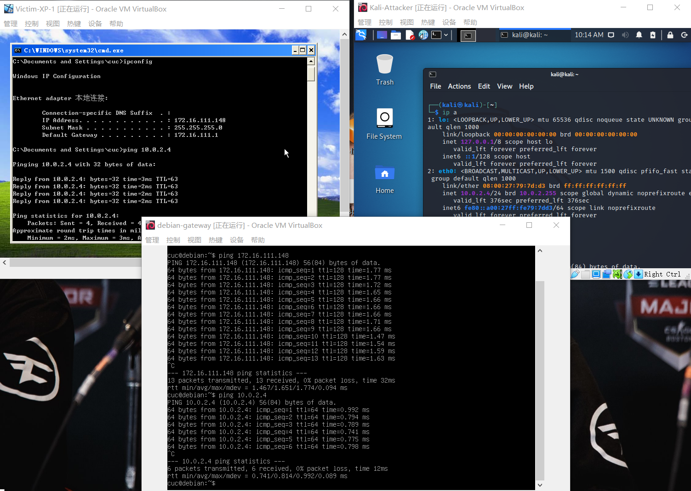

# 网络安全实验作业1

### 基于VirtualBox的网络攻防基础环境搭建

## 实验目的

- 掌握 VirtualBox 虚拟机的安装与使用；
- 掌握 VirtualBox 的虚拟网络类型和按需配置；
- 掌握 VirtualBox 的虚拟硬盘多重加载；

### 实验环境

- VirtualBox 虚拟机
- 攻击者主机（Attacker）：Kali Rolling 2109.2
- 网关（Gateway, GW）：Debian Buster
- 靶机（Victim）：From Sqli to shell / xp-sp3 / Kali

### 实验完成情况

-  [x] 多重加载、网络拓扑

  

  

- 完成以下网络连通性测试；

  - [x] 靶机可以直接访问攻击者主机

  - eg.

    

  - [x] 攻击者主机无法直接访问靶机

  - eg.

    

  - [x] 网关可以直接访问攻击者主机和靶机

  - eg.

    

  - [x] 靶机的所有对外上下行流量必须经过网关

  - eg.

    

  - [x] 所有节点均可以访问互联网
  
  - eg.
  
    

