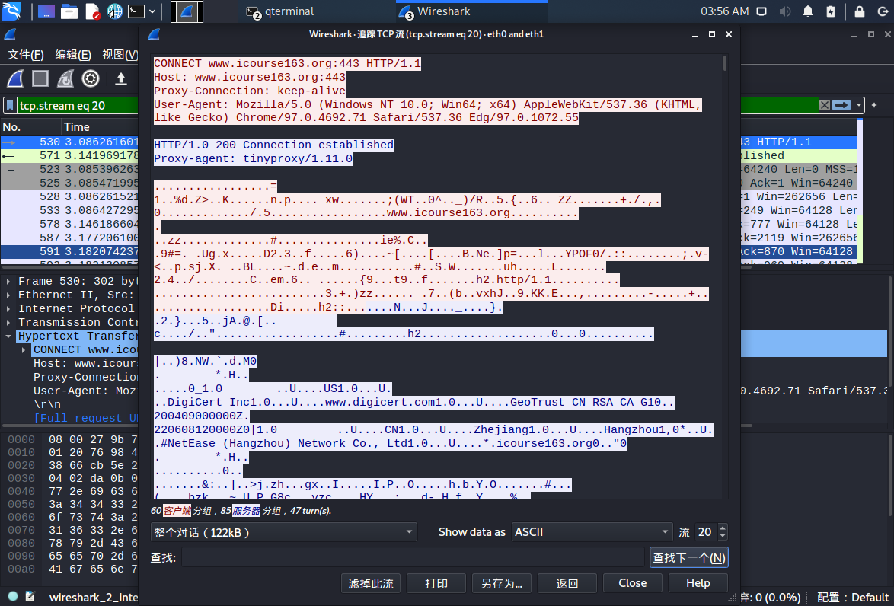

# 网络安全实验作业3

## 实验目的

- Q：使用http代理服务器访问HTTPS站点时，通信传输内容是否会被代理服务器“看到”？
- A：结论是代理服务器不知道客户端和服务器的HTTPS通信内容，但代理服务器知道客户端访问了哪个HTTPS站点，这是由http代理的协议机制决定的：代理客户端会发送Connect请求到http代理服务器。
- 实验验证：在Kali Linux中安装tinyproxy，然后用主机设置浏览器代理指向tinyproxy建立的HTTP正向代理，在Kali中用wireshark抓包，分析抓包过程，理解HTTP正向代理HTTPS流量的特点。

### 实验环境

- 主机：系统为Windows10
  ipv4:192.168.3.30
  虚拟机：系统为Kali Linux
  ipv4:192.168.56.102
  tinyproxy
  wireshark
- 网络拓扑图

### 实验过程

- [x] 下载并配置tinyproxy，取消对`Allow 10.0.0.0/8`的注释并且添加`Allow 192.168.56.0/24`实现通过host-only网卡与宿主机进行通讯的需要。

- [x] 配置SwitchyOmega插件，并将服务启用。一定要记得启用(...)，一定要记得

- [ ] 在kali中用`systemctl start proxy`命令启动proxy服务，出现以下错误。

- [x] 然而用`/etc/init.d/tinyproxy start`就没有任何问题，所以就没有管前面的错误怎么解决了。

- [x] 在kali中用wireshark抓包，用宿主机浏览网页，观察结果。首先可以用`http.request.method eq CONNECT`查看所有HTTPS代理请求，然后可以用追踪流->tcp流的方式来查看详细内容。

- [ ] 没有获得GET代理请求

### 结论：

- 不要轻信代理服务器的安全性
- 代理服务器与用户之间的数据交流是明文传输，所以会涉及信息的泄露（如cookie信息）
- 在使用开放代理时必须谨慎，避免敏感数据被嗅探和避免重要数据被篡改。
