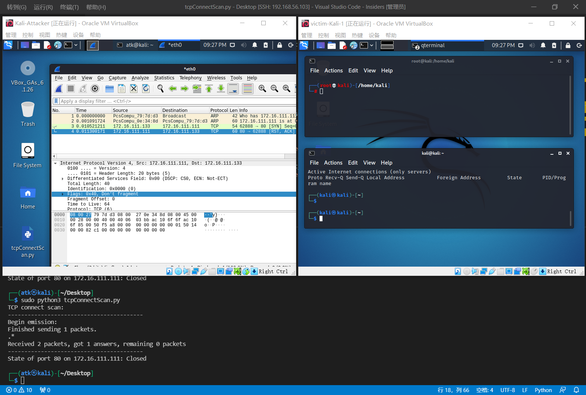
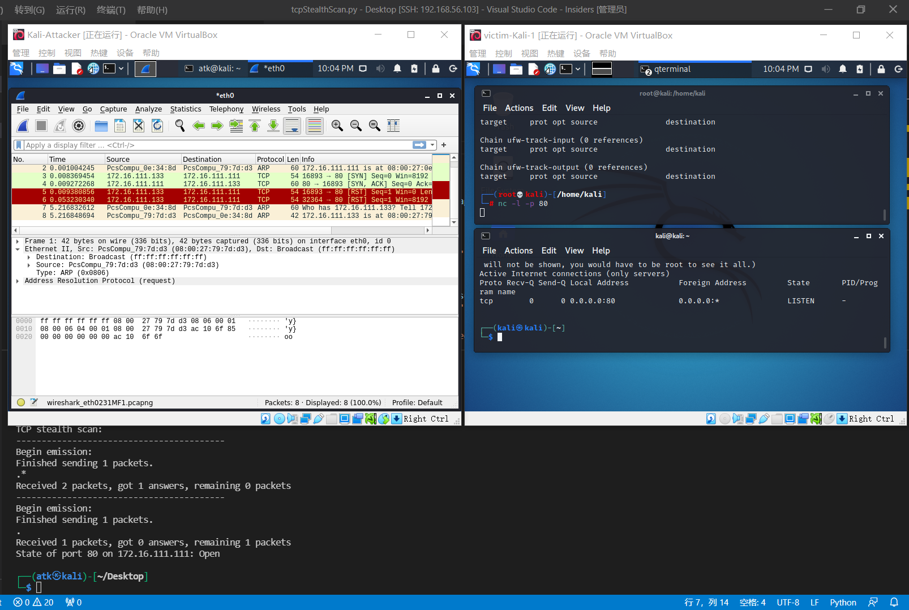

## 实验目的

- 掌握网络扫描之端口状态探测的基本原理

## 实验要求

- [x] 禁止探测互联网上的 IP ，严格遵守网络安全相关法律法规
- [x] 完成以下扫描技术的编程实现
  - TCP connect scan / TCP stealth scan
  - TCP Xmas scan / TCP fin scan / TCP null scan
  - UDP scan
- [x] 上述每种扫描技术的实现测试均需要测试端口状态为：`开放`、`关闭` 和 `过滤` 状态时的程序执行结果
- [x] 提供每一次扫描测试的抓包结果并分析与课本中的扫描方法原理是否相符？如果不同，试分析原因；
- [x] 在实验报告中详细说明实验网络环境拓扑、被测试 IP 的端口状态是如何模拟的
- [ ] （可选）复刻 `nmap` 的上述扫描技术实现的命令行参数开关

## 实验步骤

### 网络拓扑


### 端口状态的模拟

- 关闭状态
  对应端口没有开启监听， 防火墙没有开启
  
- 开启状态
  - 对应端口开启监听: tcp在`80`端口提供服务， 开启`80`端口监听可以使用`nc -l -p 80`；`DNS`服务基于`UDP`，在`53`端口提供服务， 开启`53`端口监听可以使用`service dnsmasq start`。
    ~~原来这dnsmasq不是自带的啊 需要补上sudo apt-get install dnsmasq~~
    检查：`netstat -ntlp #for tcp`
    			`netstat -nulp #for udp`
  - 防火墙处于关闭状态
  
- 过滤状态
  对应端口开启监听， 防火墙开启
  
- ~~本次实验中防火墙的开启与关闭使用的是`ufw`，操作较为简单。~~
  ~~`apt-get install ufw`~~
  ~~`ufw disable # To disable the firewall`~~
  ~~`ufw enable # To enable the firewall`~~
  直接这么用会出大问题，还是要加限定条件的，所以好像也不太简单。最终还是选择
  
  ```bash
  iptables -n -L
  # 查看本机关于IPTABLES的配置 以列表的形式显示出当前使用的 iptables 规则，并不做解析
  
  iptables -A INPUT -p tcp --dport 80 -j REJECT
  # -A 将规则添加到默认的 INPUT（入站）链的末尾的操作指令
  # -p 指定特定的协议
  # --dport 目的端口号
  
  iptables -t filter -F
  -t filter：对过滤表进行操作，用于常规的网络地址及端口过滤。
  -F：清空列表中的所有规则。
  ```
  

### 实验环境

- Kali Attacker:172.16.111.133
  Kali Victim:172.16.111.111
  debian gateway with internalnet1
  VS Code
  scapy+python

### 先验知识

TCP connect scan

> 这种扫描方式可以使用 Connect()调用，使用最基本的 TCP 三次握手链接建立机制，建立一个链接到目标主机的特定端口上。首先发送一个 SYN 数据包到目标主机的特定端口上，接着我们可以通过接收包的情况对端口的状态进行判断。

三种情况下的不同响应：

- 接收 SYN/ACK 数据包，说明端口是开放状态的；
- 接收 RST/ACK 数据包，说明端口是关闭的并且链接将会被重置；
- 目标主机没有任何响应，意味着目标主机的端口处于过滤状态。

> 若接收到 SYN/ACK 数据包（即检测到端口是开启的），便发送一个 ACK 确认包到目标主机，这样便完成了三次握手连接机制。成功后再终止连接。

TCP SYN scan

> 与 TCP Connect 扫描不同，TCP SYN 扫描并不需要打开一个完整的链接。发送一个 SYN 包启动三方握手链接机制，并等待响应。

三种情况下的不同响应：

- 接收到一个 SYN/ACK 包，表示目标端口是开放的；
- 接收到一个 RST/ACK 包，表明目标端口是关闭的；
- 没有响应，说明端口是被过滤的状态。

> 当得到的是一个 SYN/ACK 包时通过发送一个 RST 包立即拆除连接。

TCP Xmas scan

> Xmas 发送一个 TCP 包，并对 TCP 报文头 FIN、URG 和 PUSH 标记进行设置。

- 若是关闭的端口则响应 RST 报文；
- 开放或过滤状态下的端口则无任何响应

> 优点是隐蔽性好，缺点是需要自己构造数据包，要求拥有超级用户或者授权用户权限。

TCP fin scan

> 仅发送 FIN 包，它可以直接通过防火墙.

- 如果端口是关闭的就会回复一个 RST 包
- 如果端口是开放或过滤状态则对 FIN 包没有任何响应。

> 其优点是 FIN 数据包能够通过只监测 SYN 包的包过滤器，且隐蔽性高于 SYN 扫描。缺点和 SYN 扫描类似，需要自己构造数据包，要求由超级用户或者授权用户访问专门的系统调用。

TCP null scan

> 发送一个 TCP 数据包，关闭所有 TCP 报文头标记。

- 只有关闭的端口会发送 RST 响应。

> 其优点和 Xmas 一样是隐蔽性好，缺点也是需要自己构造数据包，要求拥有超级用户或者授权用户权限。

UDP scan

> UDP 是一个无链接的协议，当我们向目标主机的 UDP 端口发送数据,我们并不能收到一个开放端口的确认信息,或是关闭端口的错误信息。

- 如果收到一个 ICMP 不可到达的回应，那么则认为这个端口是关闭的
- 对于没有回应的端口则认为是开放的，但是如果目标主机安装有防火墙或其它可以过滤数据包的软硬件,那我们发出 UDP 数据包后,将可能得不到任何回应,我们将会见到所有的被扫描端口都是开放的。

UDP扫描比较简单，一般如果返回ICMP port unreachable说明端口是关闭的，而如果没有回应或有回应(有些UDP服务是有回应的但不常见)则认为是open，但由于UDP的不可靠性，无法判断报文段是丢了还是没有回应，**所以一般扫描器会发送多次**，然后根据结果再判断。这也是为什么UDP扫描这么慢的原因。

### 实验步骤

- 遇到了不管有没有sudo，wireshark都找不到网卡的问题，但是在`ip a`中是有网卡的。然后莫名其妙又好了。还遇到了exit退不出root的怪事，这个太怪了截图留了个念，猜测与之前有不太干净的输入有关。


##### TCP Connect Scan

```python
import logging
from scapy.all import *
logging.getLogger("scapy.runtime").setLevel(logging.ERROR)

dst_ip = "172.16.111.111"
src_port = RandShort()
dst_port = 80

print('TCP connect scan:')
print('-----------------------------------------')
tcp_connect_scan_resp = sr1(IP(dst=dst_ip)/TCP(sport=src_port,dport=dst_port,flags="S"),timeout=10)
print('-----------------------------------------')


if(str(type(tcp_connect_scan_resp))=="<class 'NoneType'>"):
    print('State of port '+ str(dst_port) +' on '+ str(dst_ip) +": Closed")
elif(tcp_connect_scan_resp.haslayer(TCP)):
    if(tcp_connect_scan_resp.getlayer(TCP).flags == 0x12):       
        send_rst = sr(IP(dst=dst_ip)/TCP(sport=src_port,dport=dst_port,flags="AR"),timeout=10)
        print('State of port '+ str(dst_port) +' on '+ str(dst_ip) +": Open")
    elif(tcp_connect_scan_resp.getlayer(TCP).flags == 0x14):
        # 
        print('State of port '+ str(dst_port) +' on '+ str(dst_ip) +": Closed")
elif(tcp_connect_scan_resp.haslayer(ICMP)):
    if(int(tcp_connect_scan_resp.getlayer(ICMP).type)==3 and int(tcp_connect_scan_resp.getlayer(ICMP).code) in [1,2,3,9,10,13]):
        print('State of port '+ str(dst_port) +' on '+ str(dst_ip) +": Filtered")
```

- [x] 端口关闭：
  
  相符

- [x] 端口开放：
  
  相符

- [x] 端口过滤：
  
  ~~没有完成，可以发现虽然端口状态是listen的，防火墙 可能与前面存在数据包长度过长于是DF(Don't Fragment)了有关，也可能与实验本身代码或者环境有关，但是我没找到解决方案，也没找到显著的错误信息来方便搜索。~~
  发现了是因为ufw的问题，修改之后得到与课本相符的内容。
  

##### TCP Stealth Scan

```python
import logging
from scapy.all import *
logging.getLogger("scapy.runtime").setLevel(logging.ERROR)

dst_ip = "172.16.111.111"
src_port = RandShort()
dst_port = 80

print('TCP stealth scan:')
print('-----------------------------------------')
stealth_scan_resp = sr1(IP(dst=dst_ip)/TCP(sport=src_port,dport=dst_port,flags="S"),timeout=10)
print('-----------------------------------------')

if(str(type(stealth_scan_resp))=="<class 'NoneType'>"):
    print('State of port '+ str(dst_port) +' on '+ str(dst_ip) +": Filtered")
elif(stealth_scan_resp.haslayer(TCP)):
    if(stealth_scan_resp.getlayer(TCP).flags == 0x12):
        send_rst = sr(IP(dst=dst_ip)/TCP(sport=src_port,dport=dst_port,flags="R"),timeout=10)
        print('State of port '+ str(dst_port) +' on '+ str(dst_ip) +": Open")
    elif (stealth_scan_resp.getlayer(TCP).flags == 0x14):
        print('State of port '+ str(dst_port) +' on '+ str(dst_ip) +": Closed")
elif(stealth_scan_resp.haslayer(ICMP)):
    if(int(stealth_scan_resp.getlayer(ICMP).type)==3 and int(stealth_scan_resp.getlayer(ICMP).code) in [1,2,3,9,10,13]):
        print('State of port '+ str(dst_port) +' on '+ str(dst_ip) +": Filtered")
```

- [x] 关闭状态
  
  符合
- [x] 开放状态
  
  符合
- [x] 过滤状态
  
  符合

##### TCP Xmas Scan

```python
from scapy.all import *
import logging
logging.getLogger("scapy.runtime").setLevel(logging.ERROR)

dst_ip = "172.16.111.111"
src_port = RandShort()
dst_port = 80

print('TCP xmas scan:')
print('-----------------------------------------')
xmas_scan_resp = sr1(IP(dst=dst_ip)/TCP(dport=dst_port,flags="FPU"),timeout=10)
print('-----------------------------------------')

if (str(type(xmas_scan_resp))=="<class 'NoneType'>"):
    print('State of port '+ str(dst_port) +' on '+ str(dst_ip) +": Filtered or Open")
elif(xmas_scan_resp.haslayer(TCP)):
    if(xmas_scan_resp.getlayer(TCP).flags == 0x14):
        print('State of port '+ str(dst_port) +' on '+ str(dst_ip) +": Closed")
elif(xmas_scan_resp.haslayer(ICMP)):
    if(int(xmas_scan_resp.getlayer(ICMP).type)==3 and int(xmas_scan_resp.getlayer(ICMP).code) in [1,2,3,9,10,13]):
        print('State of port '+ str(dst_port) +' on '+ str(dst_ip) +": Filtered")

```

- [x] 关闭状态
  
  符合
- [x] 开放状态
  
  符合
- [x] 过滤状态
  
  符合

##### TCP Fin Scan

```python
import logging
logging.getLogger("scapy.runtime").setLevel(logging.ERROR)
from scapy.all import *

dst_ip = "172.16.111.111"
src_port = RandShort()
dst_port = 80

print('TCP fin scan:')
print('-----------------------------------------')
fin_scan_resp = sr1(IP(dst=dst_ip)/TCP(sport=src_port,dport=dst_port,flags="F"),timeout=10)
print('-----------------------------------------')

if (str(type(fin_scan_resp))=="<class 'NoneType'>"):
    print('State of port '+ str(dst_port) +' on '+ str(dst_ip) +": Filtered or Open")
elif(fin_scan_resp.haslayer(TCP)):
    if(fin_scan_resp.getlayer(TCP).flags == 0x14):
        print('State of port '+ str(dst_port) +' on '+ str(dst_ip) +": Closed ")
elif(fin_scan_resp.haslayer(ICMP)):
    if(int(fin_scan_resp.getlayer(ICMP).type)==3 and int(fin_scan_resp.getlayer(ICMP).code) in [1,2,3,9,10,13]):
        print('State of port '+ str(dst_port) +' on '+ str(dst_ip) +": Filtered")
```

- [x] 关闭状态
  
  符合
- [x] 开放状态
  
  符合
- [x] 过滤状态
  
  符合

##### TCP Null Scan

```python
import logging
logging.getLogger("scapy.runtime").setLevel(logging.ERROR)
from scapy.all import *

dst_ip = "172.16.111.111"
src_port = RandShort()
dst_port = 80

print('TCP null scan:')
print('-----------------------------------------')
null_scan_resp = sr1(IP(dst=dst_ip)/TCP(dport=dst_port,flags=""),timeout=10)
print('-----------------------------------------')

if (str(type(null_scan_resp))=="<class 'NoneType'>"):
    print('State of port '+ str(dst_port) +' on '+ str(dst_ip) +": Filtered or Open")
elif(null_scan_resp.haslayer(TCP)):
    if(null_scan_resp.getlayer(TCP).flags == 0x14):
        print('State of port '+ str(dst_port) +' on '+ str(dst_ip) +": Closed ")
elif(null_scan_resp.haslayer(ICMP)):
    if(int(null_scan_resp.getlayer(ICMP).type)==3 and int(null_scan_resp.getlayer(ICMP).code) in [1,2,3,9,10,13]):
        print('State of port '+ str(dst_port) +' on '+ str(dst_ip) +": Filtered")
```

- [x] 关闭状态
  
  符合
- [x] 开放状态
  
  符合
- [x] 过滤状态
  
  符合

##### UDP Scan

补充一个dnsmasq安装的过程


- [x] 关闭状态
  
  符合
- [x] 开放状态
  
  符合
- [x] 过滤状态
  
  最开始是这么操作的，但是实际上得到的结论与预期不符，因为`iptables -A INPUT -p udp --dport 53 -j REJECT` 将udp协议并且发送到53端口的数据包进行过滤，自然就会过滤掉udp scan ， 从而导致结果错误。需要改成 `iptables -A INPUT -p tcp --dport 53 -j REJECT`。修改完之后得到理想的结果：
  

###### 完成实验后回到默认环境


###### 涉及代码一览


### Ref.

[泽林哥哥的仓库][https://github.com/CUCCS/2021-ns-public-EddieXu1125/tree/chap0x05/chap0x05]

[袁哥哥的仓库][https://github.com/CUCCS/2021-ns-public-Itzhakrees/blob/chap0x05/chap0x05/report.md]

[亲爱的同桌的仓库][https://github.com/CUCCS/2021-ns-public-AltSuperBlade/tree/chap0x05/chap0x05]

[关于ufw][https://linux.cn/article-12079-1.html]

[IPv4分析][https://www.cnblogs.com/craftor/p/3811739.html]

[TCP标志位详解（TCP Flag）](https://blog.csdn.net/ChenVast/article/details/77978367)
